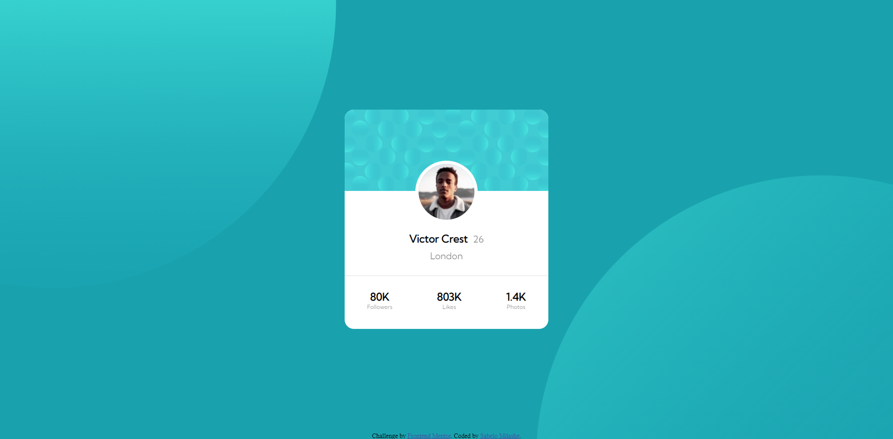

# Frontend Mentor - Profile card component solution

This is a solution to the [Profile card component challenge on Frontend Mentor](https://www.frontendmentor.io/challenges/profile-card-component-cfArpWshJ). Frontend Mentor challenges help you improve your coding skills by building realistic projects. 

## Table of contents

- [Overview](#overview)
  - [The challenge](#the-challenge)
  - [Screenshot](#screenshot)
  - [Links](#links)
- [My process](#my-process)
  - [Built with](#built-with)
  - [What I learned](#what-i-learned)
  - [Continued development](#continued-development)
  - [Useful resources](#useful-resources)
- [Author](#author)

## Overview

### The challenge

- Build out the project to the designs provided

### Screenshot



### Links

- Solution URL: [Add solution URL here](https://www.frontendmentor.io/solutions/profile-card-component-UpD-6UsV-a)
- Live Site URL: [Netlify](https://rad-peony-eacc77.netlify.app/)
- GitHub URL: [Add github URL here](https://github.com/Sabelo-Mdashe/profile-card-component-main)

## My process

### Built with

- Semantic HTML5 markup
- CSS custom properties
- Flexbox
- Mobile-first workflow

### What I learned

In this project I learnt how to use the nth-child CSS sudo-elements.


```css
span:nth-of-type(even) {
  margin-left: .3em;
}
```

### Continued development

I want to master CSS, I feel like I'm getting better and better after each project.

### Useful resources

- [Google Fonts](https://fonts.google.com) - This helped me to get fonts for the project.

## Author

- Website - [Sabelo Mdashe](http://sabelomdashe.co.za)
- Frontend Mentor - [@Sabelo-Mdashe](https://www.frontendmentor.io/profile/Sabelo-Mdashe)
- GitHub - [@Sabelo-Mdashe](https://github.com/Sabelo-Mdashe)
